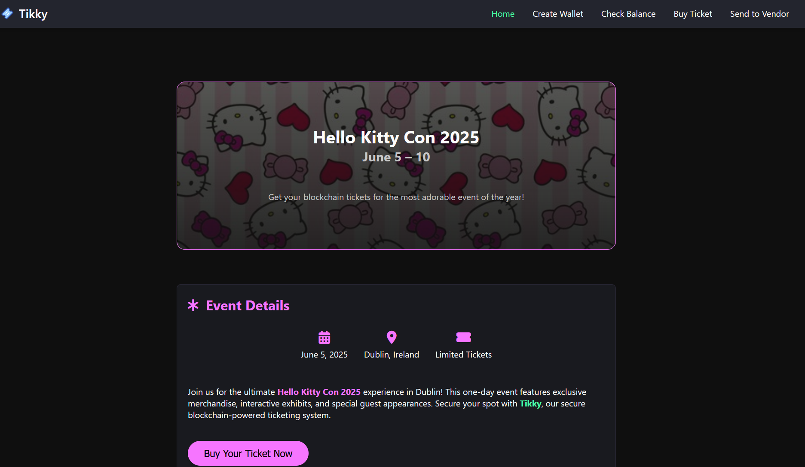
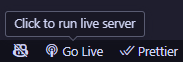

# w3-dapp

A Web3 Distributed Application (DApp) that implements a simple ticketing system.

    

## Running the App
If you are using [VSCode](https://code.visualstudio.com), install the [Live Server](https://marketplace.visualstudio.com/items?itemName=ritwickdey.LiveServer) extension (if you don't have it), clone and open this repository in VSCode, and simply click on the <code style="color: Cyan">"Go Live"</code> button at the bottom right of the UI (see below).

This should start a local server that you can open in your browser (typically at <http://localhost:5500>).

If you are not using VSCode or do not wish to use the Live Server plugin, you can use [Node.js](https://nodejs.org/en). Simply run `npm install && npm run serve`.

> [!WARNING]
> This application relies on CDNs to fetch dependencies (`web3.js` & `jQuery`) and may fail if the sources are offline.

> [!CAUTION]
> I do not recommend connecting 
> This project is for testing/demo purposes only, so please **do not** upload keystore files that contain access to real funds.
